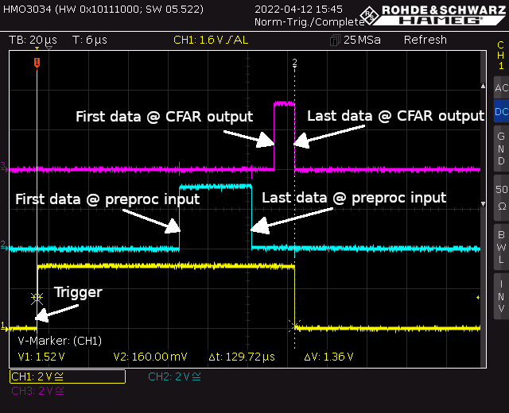

|  FFT  | Trigger → Last data @ CFAR | Trigger → First data @ preproc | First data @ preproc → Last data @ preproc | Last data @ preproc → First data @ CFAR | First data @ CFAR → Last data @ CFAR |
| :---: | :------------------------: | :----------------------------: | :----------------------------------------: | :-------------------------------------: | :----------------------------------: |
| 1024  |          246.3 us          |            72.3 us             |                  36.3 us                   |                 70.3 us                 |               68.3 us                |
|  512  |          229.3 us          |            73.3 us             |                  18.3 us                   |                 70.3 us                 |               68.3 us                |
|  256  |          222.3 us          |            75.3 us             |                   9.3 us                   |                 69.3 us                 |               69.3 us                |

| FFT + Flush | Trigger → Last data @ CFAR | Trigger → First data @ preproc | First data @ preproc → Last data @ preproc | Last data @ preproc → First data @ CFAR | First data @ CFAR → Last data @ CFAR |
| :---------: | :------------------------: | :----------------------------: | :----------------------------------------: | :-------------------------------------: | :----------------------------------: |
|    1024     |         129.72 us          |            71.72 us            |                  36.52 us                  |                10.92 us                 |               10.52 us               |
|     512     |         101.78 us          |            72.26 us            |                  18.26 us                  |                 6.34 us                 |               5.06 us                |
|     256     |          89.98 us          |            74.38 us            |                  9.18 us                   |                 3.42 us                 |               2.78 us                |

Example of time diagram for data delay:

